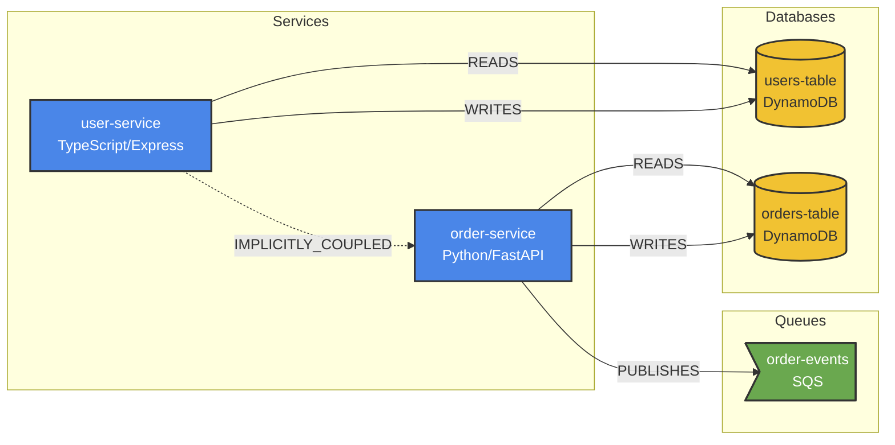

# Milestone 5: Serialization Specification

> **Spec Version**: 1.0
> **Status**: Draft
> **Implements**: IMPLEMENTATION_PLAN.md § Milestone 5
> **Depends On**: [M4 Implicit Coupling](./m4-implicit-coupling.md)

---

## 1. Overview

### 1.1 Purpose

Transform the knowledge graph into LLM-consumable formats. LLMs consume text, not graph structures—this milestone builds the critical bridge between Forge's internal representation and formats optimized for AI comprehension and human review.

### 1.2 Output Formats

| Format | Use Case | Primary Consumer |
|--------|----------|------------------|
| **Markdown** | LLM prompts, human docs | Claude, GPT, humans |
| **JSON** | Tool-based agent queries | Programmatic access |
| **Mermaid** | Visual diagrams | Human review, documentation |

### 1.3 Success Criteria

1. `forge map --format markdown` produces readable, context-rich output
2. `forge map --format json` produces schema-documented structured data
3. `forge map --format mermaid` produces valid flowchart syntax
4. `forge map --budget 4000` stays under token limit
5. Subgraph extraction correctly filters by relevance
6. Token counting is accurate (±5% vs tiktoken)

---

## 2. Subgraph Extraction

### 2.1 Relevance Scoring

```rust
// forge-graph/src/query.rs (extended for M5)

/// Configuration for subgraph extraction
#[derive(Debug, Clone)]
pub struct SubgraphConfig {
    /// Starting nodes for extraction
    pub seed_nodes: Vec<NodeId>,

    /// Maximum hops from seed nodes to include
    pub max_depth: u32,

    /// Include implicit couplings
    pub include_implicit_couplings: bool,

    /// Minimum relevance score to include (0.0 - 1.0)
    pub min_relevance: f64,

    /// Edge types to follow
    pub edge_types: Option<Vec<EdgeType>>,
}

impl Default for SubgraphConfig {
    fn default() -> Self {
        Self {
            seed_nodes: vec![],
            max_depth: 2,
            include_implicit_couplings: true,
            min_relevance: 0.1,
            edge_types: None,
        }
    }
}

/// A node with its relevance score
#[derive(Debug, Clone)]
pub struct ScoredNode<'a> {
    pub node: &'a Node,
    pub score: f64,
    pub depth: u32,
}

/// Result of subgraph extraction
#[derive(Debug)]
pub struct ExtractedSubgraph<'a> {
    /// Nodes ordered by relevance (highest first)
    pub nodes: Vec<ScoredNode<'a>>,

    /// Edges between included nodes
    pub edges: Vec<&'a Edge>,

    /// Original graph reference
    graph: &'a ForgeGraph,
}

impl ForgeGraph {
    /// Extract a relevance-scored subgraph
    pub fn extract_subgraph(&self, config: &SubgraphConfig) -> ExtractedSubgraph<'_> {
        let mut node_scores: HashMap<&NodeId, (f64, u32)> = HashMap::new();
        let mut visited: HashSet<&NodeId> = HashSet::new();
        let mut frontier: VecDeque<(&NodeId, u32, f64)> = VecDeque::new();

        // Initialize frontier with seed nodes
        for seed in &config.seed_nodes {
            if self.contains_node(seed) {
                frontier.push_back((seed, 0, 1.0)); // Full relevance for seeds
            }
        }

        // BFS with depth-limited relevance decay
        while let Some((node_id, depth, score)) = frontier.pop_front() {
            if visited.contains(&node_id) {
                continue;
            }
            visited.insert(node_id);

            // Skip if below minimum relevance
            if score < config.min_relevance {
                continue;
            }

            // Record score
            node_scores.insert(node_id, (score, depth));

            // Stop expanding at max depth
            if depth >= config.max_depth {
                continue;
            }

            // Expand neighbors
            for edge in self.edges_from(node_id) {
                if let Some(edge_types) = &config.edge_types {
                    if !edge_types.contains(&edge.edge_type) {
                        continue;
                    }
                }

                // Skip implicit couplings if not requested
                if !config.include_implicit_couplings &&
                   edge.edge_type == EdgeType::ImplicitlyCoupled
                {
                    continue;
                }

                let neighbor_score = score * edge_relevance_decay(edge);
                frontier.push_back((&edge.target, depth + 1, neighbor_score));
            }

            // Also follow incoming edges (for bidirectional relevance)
            for edge in self.edges_to(node_id) {
                if let Some(edge_types) = &config.edge_types {
                    if !edge_types.contains(&edge.edge_type) {
                        continue;
                    }
                }

                // Incoming edges have lower relevance contribution
                let neighbor_score = score * edge_relevance_decay(edge) * 0.7;
                frontier.push_back((&edge.source, depth + 1, neighbor_score));
            }
        }

        // Build scored nodes list
        let mut nodes: Vec<ScoredNode<'_>> = node_scores
            .iter()
            .filter_map(|(id, (score, depth))| {
                self.get_node(*id).map(|node| ScoredNode {
                    node,
                    score: *score,
                    depth: *depth,
                })
            })
            .collect();

        // Sort by relevance score (descending)
        nodes.sort_by(|a, b| b.score.partial_cmp(&a.score).unwrap());

        // Collect edges between included nodes
        let included_ids: HashSet<&NodeId> = node_scores.keys().copied().collect();
        let edges: Vec<&Edge> = self.edges()
            .filter(|e| {
                included_ids.contains(&e.source) && included_ids.contains(&e.target)
            })
            .collect();

        ExtractedSubgraph {
            nodes,
            edges,
            graph: self,
        }
    }
}

/// Calculate relevance decay based on edge type
fn edge_relevance_decay(edge: &Edge) -> f64 {
    match edge.edge_type {
        // Direct dependencies have high relevance
        EdgeType::Calls => 0.8,
        EdgeType::Owns => 0.9,

        // Data access is important
        EdgeType::Reads | EdgeType::Writes => 0.75,
        EdgeType::ReadsShared | EdgeType::WritesShared => 0.7,

        // Message patterns are moderately relevant
        EdgeType::Publishes | EdgeType::Subscribes => 0.65,

        // Generic usage
        EdgeType::Uses => 0.6,

        // Implicit coupling is contextual but not primary
        EdgeType::ImplicitlyCoupled => 0.5,
    }
}
```

---

## 3. Markdown Serializer

### 3.1 Output Structure

```markdown
# Ecosystem Context

## Services

### user-service
**Type**: Service | **Language**: TypeScript | **Framework**: Express

**Purpose**: Handles user authentication and profile management

**Dependencies**:
| Target | Relationship | Evidence |
|--------|--------------|----------|
| auth-service | CALLS | src/auth.ts:42 |
| users-table | READS, WRITES | src/db/users.ts:15 |

**Dependents**:
| Source | Relationship |
|--------|--------------|
| checkout-service | CALLS |
| notification-service | CALLS |

**Implicit Couplings**:
- `analytics-service` via shared `users-table` (medium risk)

---

### auth-service
...

## Databases

### users-table
**Type**: DynamoDB | **Region**: us-east-1

**Owner**: user-service

**Accessed By**:
| Service | Access Type | Evidence |
|---------|-------------|----------|
| user-service | READ/WRITE | src/db/users.ts:15 |
| analytics-service | READ | analytics/etl.py:89 |

---

## Queues

### order-events
**Type**: SQS | **Region**: us-east-1

**Publishers**: order-service
**Subscribers**: notification-service, inventory-service

---

## Implicit Couplings (Risk Summary)

| Services | Shared Resource | Risk | Reason |
|----------|-----------------|------|--------|
| user-service ↔ analytics-service | users-table | Medium | One writes, one reads |
| order-service ↔ payments-service | orders-table | High | Both write |
```

### 3.2 Implementation

```rust
// forge-cli/src/serializers/markdown.rs

use forge_graph::{ForgeGraph, Node, NodeType, EdgeType, ExtractedSubgraph, ScoredNode};
use std::fmt::Write;

pub struct MarkdownSerializer {
    /// Include business context annotations
    include_business_context: bool,

    /// Include edge evidence (file:line)
    include_evidence: bool,

    /// Maximum evidence items to show per relationship
    max_evidence_items: usize,

    /// Detail level: "full", "summary", "minimal"
    detail_level: DetailLevel,
}

#[derive(Debug, Clone, Copy)]
pub enum DetailLevel {
    /// Full details including all attributes and evidence
    Full,
    /// Summary with key attributes only
    Summary,
    /// Minimal: just names and relationships
    Minimal,
}

impl Default for MarkdownSerializer {
    fn default() -> Self {
        Self {
            include_business_context: true,
            include_evidence: true,
            max_evidence_items: 3,
            detail_level: DetailLevel::Full,
        }
    }
}

impl MarkdownSerializer {
    pub fn new() -> Self {
        Self::default()
    }

    pub fn with_detail_level(mut self, level: DetailLevel) -> Self {
        self.detail_level = level;
        self
    }

    /// Serialize an entire graph
    pub fn serialize_graph(&self, graph: &ForgeGraph) -> String {
        let mut output = String::new();

        writeln!(output, "# Ecosystem Knowledge Graph\n").unwrap();

        // Services section
        self.write_services_section(&mut output, graph);

        // Databases section
        self.write_databases_section(&mut output, graph);

        // Queues section
        self.write_queues_section(&mut output, graph);

        // Cloud Resources section
        self.write_cloud_resources_section(&mut output, graph);

        // Couplings summary
        self.write_couplings_summary(&mut output, graph);

        output
    }

    /// Serialize an extracted subgraph
    pub fn serialize_subgraph(&self, subgraph: &ExtractedSubgraph<'_>) -> String {
        let mut output = String::new();

        writeln!(output, "# Relevant Context\n").unwrap();

        // Group nodes by type
        let mut services: Vec<&ScoredNode> = vec![];
        let mut databases: Vec<&ScoredNode> = vec![];
        let mut queues: Vec<&ScoredNode> = vec![];
        let mut resources: Vec<&ScoredNode> = vec![];

        for scored_node in &subgraph.nodes {
            match scored_node.node.node_type {
                NodeType::Service => services.push(scored_node),
                NodeType::Database => databases.push(scored_node),
                NodeType::Queue => queues.push(scored_node),
                NodeType::CloudResource => resources.push(scored_node),
                NodeType::Api => {} // APIs are documented with their owning service
            }
        }

        // Write sections
        if !services.is_empty() {
            self.write_scored_section(&mut output, "Services", &services, subgraph);
        }

        if !databases.is_empty() {
            self.write_scored_section(&mut output, "Databases", &databases, subgraph);
        }

        if !queues.is_empty() {
            self.write_scored_section(&mut output, "Queues", &queues, subgraph);
        }

        if !resources.is_empty() {
            self.write_scored_section(&mut output, "Cloud Resources", &resources, subgraph);
        }

        output
    }

    fn write_services_section(&self, output: &mut String, graph: &ForgeGraph) {
        let services: Vec<_> = graph.nodes_by_type(NodeType::Service).collect();
        if services.is_empty() {
            return;
        }

        writeln!(output, "## Services\n").unwrap();

        for service in services {
            self.write_service_node(output, service, graph);
        }
    }

    fn write_service_node(&self, output: &mut String, node: &Node, graph: &ForgeGraph) {
        writeln!(output, "### {}\n", node.display_name).unwrap();

        // Basic info
        let language = node.attributes.get("language")
            .and_then(|v| v.as_str())
            .unwrap_or("unknown");

        let framework = node.attributes.get("framework")
            .and_then(|v| v.as_str());

        write!(output, "**Type**: Service | **Language**: {}", language).unwrap();
        if let Some(fw) = framework {
            write!(output, " | **Framework**: {}", fw).unwrap();
        }
        writeln!(output, "\n").unwrap();

        // Business context
        if self.include_business_context {
            if let Some(ctx) = &node.business_context {
                if let Some(purpose) = &ctx.purpose {
                    writeln!(output, "**Purpose**: {}\n", purpose).unwrap();
                }
                if let Some(owner) = &ctx.owner {
                    writeln!(output, "**Owner**: {}\n", owner).unwrap();
                }
            }
        }

        // Dependencies (outgoing edges)
        let deps = graph.edges_from(&node.id);
        if !deps.is_empty() {
            writeln!(output, "**Dependencies**:").unwrap();
            writeln!(output, "| Target | Relationship | Evidence |").unwrap();
            writeln!(output, "|--------|--------------|----------|").unwrap();

            for edge in deps {
                if let Some(target) = graph.get_node(&edge.target) {
                    let evidence = self.format_evidence(&edge.metadata.evidence);
                    writeln!(
                        output,
                        "| {} | {:?} | {} |",
                        target.display_name,
                        edge.edge_type,
                        evidence
                    ).unwrap();
                }
            }
            writeln!(output).unwrap();
        }

        // Dependents (incoming CALLS edges)
        let dependents: Vec<_> = graph.edges_to(&node.id)
            .into_iter()
            .filter(|e| e.edge_type == EdgeType::Calls)
            .collect();

        if !dependents.is_empty() {
            writeln!(output, "**Dependents**:").unwrap();
            writeln!(output, "| Source | Relationship |").unwrap();
            writeln!(output, "|--------|--------------|").unwrap();

            for edge in dependents {
                if let Some(source) = graph.get_node(&edge.source) {
                    writeln!(output, "| {} | CALLS |", source.display_name).unwrap();
                }
            }
            writeln!(output).unwrap();
        }

        // Implicit couplings
        let couplings: Vec<_> = graph.edges_from(&node.id)
            .into_iter()
            .chain(graph.edges_to(&node.id))
            .filter(|e| e.edge_type == EdgeType::ImplicitlyCoupled)
            .collect();

        if !couplings.is_empty() {
            writeln!(output, "**Implicit Couplings**:").unwrap();
            for edge in couplings {
                let other_id = if edge.source == node.id { &edge.target } else { &edge.source };
                if let Some(other) = graph.get_node(other_id) {
                    let reason = edge.metadata.reason.as_deref().unwrap_or("shared resource");
                    writeln!(output, "- `{}` - {}", other.display_name, reason).unwrap();
                }
            }
            writeln!(output).unwrap();
        }

        writeln!(output, "---\n").unwrap();
    }

    fn write_databases_section(&self, output: &mut String, graph: &ForgeGraph) {
        let databases: Vec<_> = graph.nodes_by_type(NodeType::Database).collect();
        if databases.is_empty() {
            return;
        }

        writeln!(output, "## Databases\n").unwrap();

        for db in databases {
            self.write_database_node(output, db, graph);
        }
    }

    fn write_database_node(&self, output: &mut String, node: &Node, graph: &ForgeGraph) {
        writeln!(output, "### {}\n", node.display_name).unwrap();

        let db_type = node.attributes.get("db_type")
            .and_then(|v| v.as_str())
            .unwrap_or("unknown");

        writeln!(output, "**Type**: {}", db_type).unwrap();

        // Find owner
        let owner = graph.edges_to(&node.id)
            .into_iter()
            .find(|e| e.edge_type == EdgeType::Owns)
            .and_then(|e| graph.get_node(&e.source));

        if let Some(owner) = owner {
            writeln!(output, "**Owner**: {}\n", owner.display_name).unwrap();
        }

        // Accessing services
        let accessors: Vec<_> = graph.edges_to(&node.id)
            .into_iter()
            .filter(|e| matches!(e.edge_type,
                EdgeType::Reads | EdgeType::Writes |
                EdgeType::ReadsShared | EdgeType::WritesShared
            ))
            .collect();

        if !accessors.is_empty() {
            writeln!(output, "**Accessed By**:").unwrap();
            writeln!(output, "| Service | Access Type | Evidence |").unwrap();
            writeln!(output, "|---------|-------------|----------|").unwrap();

            for edge in accessors {
                if let Some(service) = graph.get_node(&edge.source) {
                    let access_type = match edge.edge_type {
                        EdgeType::Reads | EdgeType::ReadsShared => "READ",
                        EdgeType::Writes | EdgeType::WritesShared => "WRITE",
                        _ => "UNKNOWN",
                    };
                    let evidence = self.format_evidence(&edge.metadata.evidence);
                    writeln!(
                        output,
                        "| {} | {} | {} |",
                        service.display_name,
                        access_type,
                        evidence
                    ).unwrap();
                }
            }
            writeln!(output).unwrap();
        }

        writeln!(output, "---\n").unwrap();
    }

    fn write_queues_section(&self, output: &mut String, graph: &ForgeGraph) {
        let queues: Vec<_> = graph.nodes_by_type(NodeType::Queue).collect();
        if queues.is_empty() {
            return;
        }

        writeln!(output, "## Queues\n").unwrap();

        for queue in queues {
            self.write_queue_node(output, queue, graph);
        }
    }

    fn write_queue_node(&self, output: &mut String, node: &Node, graph: &ForgeGraph) {
        writeln!(output, "### {}\n", node.display_name).unwrap();

        let queue_type = node.attributes.get("queue_type")
            .and_then(|v| v.as_str())
            .unwrap_or("unknown");

        writeln!(output, "**Type**: {}", queue_type).unwrap();

        // Publishers
        let publishers: Vec<_> = graph.edges_to(&node.id)
            .into_iter()
            .filter(|e| e.edge_type == EdgeType::Publishes)
            .filter_map(|e| graph.get_node(&e.source))
            .collect();

        if !publishers.is_empty() {
            let names: Vec<_> = publishers.iter().map(|n| n.display_name.as_str()).collect();
            writeln!(output, "**Publishers**: {}", names.join(", ")).unwrap();
        }

        // Subscribers
        let subscribers: Vec<_> = graph.edges_to(&node.id)
            .into_iter()
            .filter(|e| e.edge_type == EdgeType::Subscribes)
            .filter_map(|e| graph.get_node(&e.source))
            .collect();

        if !subscribers.is_empty() {
            let names: Vec<_> = subscribers.iter().map(|n| n.display_name.as_str()).collect();
            writeln!(output, "**Subscribers**: {}", names.join(", ")).unwrap();
        }

        writeln!(output, "\n---\n").unwrap();
    }

    fn write_cloud_resources_section(&self, output: &mut String, graph: &ForgeGraph) {
        let resources: Vec<_> = graph.nodes_by_type(NodeType::CloudResource).collect();
        if resources.is_empty() {
            return;
        }

        writeln!(output, "## Cloud Resources\n").unwrap();

        for resource in resources {
            let resource_type = resource.attributes.get("resource_type")
                .and_then(|v| v.as_str())
                .unwrap_or("unknown");

            writeln!(output, "### {} ({})\n", resource.display_name, resource_type).unwrap();

            let users: Vec<_> = graph.edges_to(&resource.id)
                .into_iter()
                .filter(|e| e.edge_type == EdgeType::Uses)
                .filter_map(|e| graph.get_node(&e.source))
                .collect();

            if !users.is_empty() {
                let names: Vec<_> = users.iter().map(|n| n.display_name.as_str()).collect();
                writeln!(output, "**Used By**: {}\n", names.join(", ")).unwrap();
            }

            writeln!(output, "---\n").unwrap();
        }
    }

    fn write_couplings_summary(&self, output: &mut String, graph: &ForgeGraph) {
        let couplings: Vec<_> = graph.edges()
            .filter(|e| e.edge_type == EdgeType::ImplicitlyCoupled)
            .collect();

        if couplings.is_empty() {
            return;
        }

        writeln!(output, "## Implicit Couplings (Risk Summary)\n").unwrap();
        writeln!(output, "| Services | Shared Resource | Risk | Reason |").unwrap();
        writeln!(output, "|----------|-----------------|------|--------|").unwrap();

        for edge in couplings {
            let service_a = graph.get_node(&edge.source)
                .map(|n| n.display_name.as_str())
                .unwrap_or("?");
            let service_b = graph.get_node(&edge.target)
                .map(|n| n.display_name.as_str())
                .unwrap_or("?");

            let reason = edge.metadata.reason.as_deref().unwrap_or("shared resource");
            let risk = if reason.contains("High") { "High" }
                else if reason.contains("Medium") { "Medium" }
                else { "Low" };

            writeln!(
                output,
                "| {} ↔ {} | - | {} | {} |",
                service_a, service_b, risk, reason
            ).unwrap();
        }

        writeln!(output).unwrap();
    }

    fn write_scored_section(
        &self,
        output: &mut String,
        title: &str,
        nodes: &[&ScoredNode<'_>],
        subgraph: &ExtractedSubgraph<'_>,
    ) {
        writeln!(output, "## {}\n", title).unwrap();

        for scored in nodes {
            let relevance_indicator = if scored.score > 0.8 {
                "🔴" // High relevance
            } else if scored.score > 0.5 {
                "🟡" // Medium relevance
            } else {
                "🟢" // Context/low relevance
            };

            writeln!(
                output,
                "### {} {} (relevance: {:.0}%)\n",
                scored.node.display_name,
                relevance_indicator,
                scored.score * 100.0
            ).unwrap();

            // Write abbreviated details based on relevance
            if scored.score > 0.5 {
                self.write_service_details(output, scored.node, subgraph);
            } else {
                // Just show existence for low-relevance nodes
                writeln!(output, "*Exists in ecosystem*\n").unwrap();
            }

            writeln!(output, "---\n").unwrap();
        }
    }

    fn write_service_details(&self, output: &mut String, node: &Node, subgraph: &ExtractedSubgraph<'_>) {
        // Language/type
        if let Some(lang) = node.attributes.get("language").and_then(|v| v.as_str()) {
            writeln!(output, "**Language**: {}", lang).unwrap();
        }

        // Business context
        if let Some(ctx) = &node.business_context {
            if let Some(purpose) = &ctx.purpose {
                writeln!(output, "**Purpose**: {}", purpose).unwrap();
            }
        }

        // Related edges in subgraph
        let related_edges: Vec<_> = subgraph.edges.iter()
            .filter(|e| e.source == node.id || e.target == node.id)
            .collect();

        if !related_edges.is_empty() {
            writeln!(output, "\n**Relationships in context**:").unwrap();
            for edge in related_edges {
                let other_id = if edge.source == node.id { &edge.target } else { &edge.source };
                let direction = if edge.source == node.id { "→" } else { "←" };

                if let Some(other) = subgraph.graph.get_node(other_id) {
                    writeln!(
                        output,
                        "- {} {:?} {}",
                        direction, edge.edge_type, other.display_name
                    ).unwrap();
                }
            }
        }

        writeln!(output).unwrap();
    }

    fn format_evidence(&self, evidence: &[String]) -> String {
        if evidence.is_empty() {
            return "-".to_string();
        }

        let items: Vec<_> = evidence.iter()
            .take(self.max_evidence_items)
            .map(|e| format!("`{}`", e))
            .collect();

        let mut result = items.join(", ");

        if evidence.len() > self.max_evidence_items {
            result.push_str(&format!(" +{} more", evidence.len() - self.max_evidence_items));
        }

        result
    }
}
```

---

## 4. JSON Serializer

### 4.1 Output Schema

```json
{
  "$schema": "https://forge.dev/schemas/graph-v1.json",
  "version": "1.0.0",
  "generated_at": "2024-01-15T10:30:00Z",
  "query": {
    "type": "subgraph",
    "seeds": ["service:ns:user-api"],
    "max_depth": 2
  },
  "nodes": [
    {
      "id": "service:ns:user-api",
      "type": "service",
      "name": "user-api",
      "relevance": 1.0,
      "attributes": {
        "language": "typescript",
        "framework": "express"
      },
      "business_context": {
        "purpose": "Handles user authentication",
        "owner": "Platform Team"
      }
    }
  ],
  "edges": [
    {
      "source": "service:ns:user-api",
      "target": "database:ns:users-table",
      "type": "READS",
      "metadata": {
        "evidence": ["src/db/users.ts:42"]
      }
    }
  ],
  "summary": {
    "total_nodes": 5,
    "total_edges": 8,
    "by_type": {
      "service": 2,
      "database": 1,
      "queue": 1,
      "cloud_resource": 1
    }
  }
}
```

### 4.2 Implementation

```rust
// forge-cli/src/serializers/json.rs

use serde::{Serialize, Deserialize};
use forge_graph::{ForgeGraph, ExtractedSubgraph};

#[derive(Debug, Serialize, Deserialize)]
pub struct JsonOutput {
    #[serde(rename = "$schema")]
    pub schema: String,
    pub version: String,
    pub generated_at: String,
    #[serde(skip_serializing_if = "Option::is_none")]
    pub query: Option<QueryInfo>,
    pub nodes: Vec<JsonNode>,
    pub edges: Vec<JsonEdge>,
    pub summary: Summary,
}

#[derive(Debug, Serialize, Deserialize)]
pub struct QueryInfo {
    #[serde(rename = "type")]
    pub query_type: String,
    #[serde(skip_serializing_if = "Option::is_none")]
    pub seeds: Option<Vec<String>>,
    #[serde(skip_serializing_if = "Option::is_none")]
    pub max_depth: Option<u32>,
}

#[derive(Debug, Serialize, Deserialize)]
pub struct JsonNode {
    pub id: String,
    #[serde(rename = "type")]
    pub node_type: String,
    pub name: String,
    #[serde(skip_serializing_if = "Option::is_none")]
    pub relevance: Option<f64>,
    pub attributes: serde_json::Value,
    #[serde(skip_serializing_if = "Option::is_none")]
    pub business_context: Option<serde_json::Value>,
}

#[derive(Debug, Serialize, Deserialize)]
pub struct JsonEdge {
    pub source: String,
    pub target: String,
    #[serde(rename = "type")]
    pub edge_type: String,
    pub metadata: serde_json::Value,
}

#[derive(Debug, Serialize, Deserialize)]
pub struct Summary {
    pub total_nodes: usize,
    pub total_edges: usize,
    pub by_type: std::collections::HashMap<String, usize>,
}

pub struct JsonSerializer;

impl JsonSerializer {
    pub fn serialize_graph(graph: &ForgeGraph) -> String {
        let output = Self::build_output(graph, None);
        serde_json::to_string_pretty(&output).unwrap()
    }

    pub fn serialize_subgraph(subgraph: &ExtractedSubgraph<'_>, query: Option<QueryInfo>) -> String {
        let mut output = Self::build_output(subgraph.graph, query);

        // Replace nodes with scored nodes from subgraph
        output.nodes = subgraph.nodes.iter()
            .map(|scored| JsonNode {
                id: scored.node.id.as_str().to_string(),
                node_type: format!("{:?}", scored.node.node_type).to_lowercase(),
                name: scored.node.display_name.clone(),
                relevance: Some(scored.score),
                attributes: serde_json::to_value(&scored.node.attributes).unwrap(),
                business_context: scored.node.business_context.as_ref()
                    .map(|bc| serde_json::to_value(bc).unwrap()),
            })
            .collect();

        // Replace edges with subgraph edges
        output.edges = subgraph.edges.iter()
            .map(|edge| JsonEdge {
                source: edge.source.as_str().to_string(),
                target: edge.target.as_str().to_string(),
                edge_type: format!("{:?}", edge.edge_type),
                metadata: serde_json::to_value(&edge.metadata).unwrap(),
            })
            .collect();

        // Update summary
        output.summary.total_nodes = output.nodes.len();
        output.summary.total_edges = output.edges.len();

        serde_json::to_string_pretty(&output).unwrap()
    }

    fn build_output(graph: &ForgeGraph, query: Option<QueryInfo>) -> JsonOutput {
        let mut by_type: std::collections::HashMap<String, usize> = std::collections::HashMap::new();

        let nodes: Vec<JsonNode> = graph.nodes()
            .map(|node| {
                let type_str = format!("{:?}", node.node_type).to_lowercase();
                *by_type.entry(type_str.clone()).or_insert(0) += 1;

                JsonNode {
                    id: node.id.as_str().to_string(),
                    node_type: type_str,
                    name: node.display_name.clone(),
                    relevance: None,
                    attributes: serde_json::to_value(&node.attributes).unwrap(),
                    business_context: node.business_context.as_ref()
                        .map(|bc| serde_json::to_value(bc).unwrap()),
                }
            })
            .collect();

        let edges: Vec<JsonEdge> = graph.edges()
            .map(|edge| JsonEdge {
                source: edge.source.as_str().to_string(),
                target: edge.target.as_str().to_string(),
                edge_type: format!("{:?}", edge.edge_type),
                metadata: serde_json::to_value(&edge.metadata).unwrap(),
            })
            .collect();

        JsonOutput {
            schema: "https://forge.dev/schemas/graph-v1.json".to_string(),
            version: "1.0.0".to_string(),
            generated_at: chrono::Utc::now().to_rfc3339(),
            query,
            nodes,
            edges,
            summary: Summary {
                total_nodes: graph.node_count(),
                total_edges: graph.edge_count(),
                by_type,
            },
        }
    }
}
```

---

## 5. Mermaid Serializer

### 5.1 Output Format



### 5.2 Implementation

```rust
// forge-cli/src/serializers/mermaid.rs

use forge_graph::{ForgeGraph, NodeType, EdgeType, ExtractedSubgraph};
use std::fmt::Write;

pub struct MermaidSerializer {
    /// Direction: LR, RL, TB, BT
    direction: String,

    /// Include node attributes in labels
    include_attributes: bool,

    /// Maximum nodes before simplifying
    max_nodes: usize,
}

impl Default for MermaidSerializer {
    fn default() -> Self {
        Self {
            direction: "LR".to_string(),
            include_attributes: true,
            max_nodes: 50,
        }
    }
}

impl MermaidSerializer {
    pub fn serialize_graph(&self, graph: &ForgeGraph) -> String {
        let mut output = String::new();

        writeln!(output, "flowchart {}", self.direction).unwrap();

        // Group nodes by type into subgraphs
        self.write_services_subgraph(&mut output, graph);
        self.write_databases_subgraph(&mut output, graph);
        self.write_queues_subgraph(&mut output, graph);
        self.write_cloud_resources_subgraph(&mut output, graph);

        // Write edges
        writeln!(output).unwrap();
        self.write_edges(&mut output, graph);

        // Write style classes
        writeln!(output).unwrap();
        self.write_style_classes(&mut output);

        output
    }

    pub fn serialize_subgraph(&self, subgraph: &ExtractedSubgraph<'_>) -> String {
        let mut output = String::new();

        writeln!(output, "flowchart {}", self.direction).unwrap();

        // Create subgraphs for each type
        let mut services = vec![];
        let mut databases = vec![];
        let mut queues = vec![];
        let mut resources = vec![];

        for scored in &subgraph.nodes {
            match scored.node.node_type {
                NodeType::Service => services.push(scored.node),
                NodeType::Database => databases.push(scored.node),
                NodeType::Queue => queues.push(scored.node),
                NodeType::CloudResource => resources.push(scored.node),
                _ => {}
            }
        }

        if !services.is_empty() {
            self.write_subgraph_group(&mut output, "Services", &services);
        }
        if !databases.is_empty() {
            self.write_subgraph_group(&mut output, "Databases", &databases);
        }
        if !queues.is_empty() {
            self.write_subgraph_group(&mut output, "Queues", &queues);
        }
        if !resources.is_empty() {
            self.write_subgraph_group(&mut output, "Resources", &resources);
        }

        // Write edges
        writeln!(output).unwrap();
        for edge in &subgraph.edges {
            let source_id = self.sanitize_id(edge.source.as_str());
            let target_id = self.sanitize_id(edge.target.as_str());
            let edge_label = format!("{:?}", edge.edge_type);

            let line_style = if edge.edge_type == EdgeType::ImplicitlyCoupled {
                "-.->"
            } else {
                "-->"
            };

            writeln!(output, "    {} {}|{}| {}", source_id, line_style, edge_label, target_id).unwrap();
        }

        // Write styles
        writeln!(output).unwrap();
        self.write_style_classes(&mut output);

        output
    }

    fn write_services_subgraph(&self, output: &mut String, graph: &ForgeGraph) {
        let services: Vec<_> = graph.nodes_by_type(NodeType::Service).collect();
        if services.is_empty() {
            return;
        }

        writeln!(output, "    subgraph Services").unwrap();

        for service in services {
            let id = self.sanitize_id(service.id.as_str());
            let label = self.build_service_label(service);
            writeln!(output, "        {}[{}]", id, label).unwrap();
        }

        writeln!(output, "    end").unwrap();
    }

    fn write_databases_subgraph(&self, output: &mut String, graph: &ForgeGraph) {
        let databases: Vec<_> = graph.nodes_by_type(NodeType::Database).collect();
        if databases.is_empty() {
            return;
        }

        writeln!(output, "    subgraph Databases").unwrap();

        for db in databases {
            let id = self.sanitize_id(db.id.as_str());
            let label = self.build_db_label(db);
            // Use cylinder shape for databases
            writeln!(output, "        {}[(\"{}\")]", id, label).unwrap();
        }

        writeln!(output, "    end").unwrap();
    }

    fn write_queues_subgraph(&self, output: &mut String, graph: &ForgeGraph) {
        let queues: Vec<_> = graph.nodes_by_type(NodeType::Queue).collect();
        if queues.is_empty() {
            return;
        }

        writeln!(output, "    subgraph Queues").unwrap();

        for queue in queues {
            let id = self.sanitize_id(queue.id.as_str());
            let label = self.build_queue_label(queue);
            // Use asymmetric shape for queues
            writeln!(output, "        {}>{}]", id, label).unwrap();
        }

        writeln!(output, "    end").unwrap();
    }

    fn write_cloud_resources_subgraph(&self, output: &mut String, graph: &ForgeGraph) {
        let resources: Vec<_> = graph.nodes_by_type(NodeType::CloudResource).collect();
        if resources.is_empty() {
            return;
        }

        writeln!(output, "    subgraph Resources").unwrap();

        for resource in resources {
            let id = self.sanitize_id(resource.id.as_str());
            let label = &resource.display_name;
            // Use hexagon shape for cloud resources
            writeln!(output, "        {}{{{{{}}}}}", id, label).unwrap();
        }

        writeln!(output, "    end").unwrap();
    }

    fn write_subgraph_group(&self, output: &mut String, name: &str, nodes: &[&Node]) {
        writeln!(output, "    subgraph {}", name).unwrap();

        for node in nodes {
            let id = self.sanitize_id(node.id.as_str());
            let label = self.build_node_label(node);
            let shape = match node.node_type {
                NodeType::Service => format!("[{}]", label),
                NodeType::Database => format!("[({})]", label),
                NodeType::Queue => format!("[>{}]", label),
                NodeType::CloudResource => format!("{{{{{}}}}}", label),
                NodeType::Api => format!("([{}])", label),
            };
            writeln!(output, "        {}{}", id, shape).unwrap();
        }

        writeln!(output, "    end").unwrap();
    }

    fn write_edges(&self, output: &mut String, graph: &ForgeGraph) {
        for edge in graph.edges() {
            let source_id = self.sanitize_id(edge.source.as_str());
            let target_id = self.sanitize_id(edge.target.as_str());
            let label = format!("{:?}", edge.edge_type);

            let line_style = match edge.edge_type {
                EdgeType::ImplicitlyCoupled => "-.->" ,
                EdgeType::Calls => "-->",
                _ => "-->",
            };

            writeln!(output, "    {} {}|{}| {}", source_id, line_style, label, target_id).unwrap();
        }
    }

    fn write_style_classes(&self, output: &mut String) {
        writeln!(output, "    classDef service fill:#4a86e8,stroke:#333,stroke-width:2px,color:white").unwrap();
        writeln!(output, "    classDef database fill:#f1c232,stroke:#333,stroke-width:2px").unwrap();
        writeln!(output, "    classDef queue fill:#6aa84f,stroke:#333,stroke-width:2px,color:white").unwrap();
        writeln!(output, "    classDef resource fill:#9fc5e8,stroke:#333,stroke-width:2px").unwrap();
    }

    fn sanitize_id(&self, id: &str) -> String {
        id.replace(':', "_").replace('-', "_").replace('/', "_")
    }

    fn build_service_label(&self, node: &Node) -> String {
        if !self.include_attributes {
            return node.display_name.clone();
        }

        let mut label = node.display_name.clone();

        let lang = node.attributes.get("language")
            .and_then(|v| v.as_str())
            .unwrap_or("");

        let framework = node.attributes.get("framework")
            .and_then(|v| v.as_str());

        if !lang.is_empty() {
            label.push_str("<br/>");
            if let Some(fw) = framework {
                label.push_str(&format!("{}/{}", lang, fw));
            } else {
                label.push_str(lang);
            }
        }

        label
    }

    fn build_db_label(&self, node: &Node) -> String {
        if !self.include_attributes {
            return node.display_name.clone();
        }

        let mut label = node.display_name.clone();

        if let Some(db_type) = node.attributes.get("db_type").and_then(|v| v.as_str()) {
            label.push_str(&format!("<br/>{}", db_type));
        }

        label
    }

    fn build_queue_label(&self, node: &Node) -> String {
        if !self.include_attributes {
            return node.display_name.clone();
        }

        let mut label = node.display_name.clone();

        if let Some(q_type) = node.attributes.get("queue_type").and_then(|v| v.as_str()) {
            label.push_str(&format!("<br/>{}", q_type));
        }

        label
    }

    fn build_node_label(&self, node: &Node) -> String {
        match node.node_type {
            NodeType::Service => self.build_service_label(node),
            NodeType::Database => self.build_db_label(node),
            NodeType::Queue => self.build_queue_label(node),
            _ => node.display_name.clone(),
        }
    }
}
```

---

## 6. Token Budgeting

### 6.1 Token Counting

```rust
// forge-cli/src/token_budget.rs

use tiktoken_rs::cl100k_base;

pub struct TokenCounter {
    bpe: tiktoken_rs::CoreBPE,
}

impl TokenCounter {
    pub fn new() -> Self {
        Self {
            bpe: cl100k_base().unwrap(),
        }
    }

    /// Count tokens in a string
    pub fn count(&self, text: &str) -> usize {
        self.bpe.encode_with_special_tokens(text).len()
    }

    /// Estimate tokens for a node
    pub fn estimate_node_tokens(&self, node: &Node, detail_level: DetailLevel) -> usize {
        match detail_level {
            DetailLevel::Full => 100 + self.count(&node.display_name) * 2,
            DetailLevel::Summary => 50 + self.count(&node.display_name),
            DetailLevel::Minimal => 10 + self.count(&node.display_name),
        }
    }

    /// Estimate tokens for an edge
    pub fn estimate_edge_tokens(&self) -> usize {
        30 // Approximate tokens per edge in output
    }
}

/// Budget-constrained serialization
pub struct BudgetedSerializer {
    counter: TokenCounter,
    budget: usize,
}

impl BudgetedSerializer {
    pub fn new(budget: usize) -> Self {
        Self {
            counter: TokenCounter::new(),
            budget,
        }
    }

    /// Serialize a subgraph within token budget
    pub fn serialize_within_budget(
        &self,
        subgraph: &ExtractedSubgraph<'_>,
        format: OutputFormat,
    ) -> String {
        // Start with highest relevance nodes and add until budget reached
        let mut included_nodes = vec![];
        let mut estimated_tokens = 0;
        let header_tokens = 100; // Reserve for headers/structure

        for scored_node in &subgraph.nodes {
            let node_tokens = self.counter.estimate_node_tokens(
                scored_node.node,
                self.detail_level_for_relevance(scored_node.score),
            );

            if estimated_tokens + node_tokens + header_tokens > self.budget {
                break;
            }

            included_nodes.push(scored_node);
            estimated_tokens += node_tokens;
        }

        // Add edges for included nodes
        let included_ids: std::collections::HashSet<_> = included_nodes
            .iter()
            .map(|n| &n.node.id)
            .collect();

        let included_edges: Vec<_> = subgraph.edges
            .iter()
            .filter(|e| included_ids.contains(&e.source) && included_ids.contains(&e.target))
            .take((self.budget - estimated_tokens) / self.counter.estimate_edge_tokens())
            .collect();

        // Serialize based on format
        match format {
            OutputFormat::Markdown => {
                let serializer = MarkdownSerializer::default();
                // Serialize only included nodes
                self.serialize_markdown_budgeted(&serializer, &included_nodes, &included_edges, subgraph)
            }
            OutputFormat::Json => {
                // JSON doesn't need budget truncation - structure is fixed
                JsonSerializer::serialize_subgraph(subgraph, None)
            }
            OutputFormat::Mermaid => {
                let serializer = MermaidSerializer::default();
                serializer.serialize_subgraph(subgraph)
            }
        }
    }

    fn detail_level_for_relevance(&self, score: f64) -> DetailLevel {
        if score > 0.7 {
            DetailLevel::Full
        } else if score > 0.4 {
            DetailLevel::Summary
        } else {
            DetailLevel::Minimal
        }
    }

    fn serialize_markdown_budgeted(
        &self,
        serializer: &MarkdownSerializer,
        nodes: &[&ScoredNode<'_>],
        edges: &[&&Edge],
        subgraph: &ExtractedSubgraph<'_>,
    ) -> String {
        // Build truncated markdown with budget awareness
        let mut output = String::new();
        writeln!(output, "# Context (Budget: {} tokens)\n", self.budget).unwrap();

        for scored in nodes {
            let detail = self.detail_level_for_relevance(scored.score);

            match detail {
                DetailLevel::Full => {
                    writeln!(output, "## {}\n", scored.node.display_name).unwrap();
                    // Write full details
                }
                DetailLevel::Summary => {
                    writeln!(output, "### {} (summary)\n", scored.node.display_name).unwrap();
                    // Write abbreviated details
                }
                DetailLevel::Minimal => {
                    writeln!(output, "- {} (exists)\n", scored.node.display_name).unwrap();
                }
            }
        }

        output
    }
}

#[derive(Debug, Clone, Copy)]
pub enum OutputFormat {
    Markdown,
    Json,
    Mermaid,
}
```

---

## 7. forge map Command

```rust
// forge-cli/src/commands/map.rs

use clap::Args;

#[derive(Args, Debug)]
pub struct MapArgs {
    /// Output format: markdown, json, mermaid
    #[arg(short, long, default_value = "markdown")]
    format: String,

    /// Filter to specific services (comma-separated)
    #[arg(short, long)]
    service: Option<String>,

    /// Token budget limit
    #[arg(short, long)]
    budget: Option<usize>,

    /// Input graph path (overrides config)
    #[arg(short, long)]
    input: Option<String>,

    /// Output file (default: stdout)
    #[arg(short, long)]
    output: Option<String>,

    /// Query string for subgraph extraction
    #[arg(short, long)]
    query: Option<String>,
}

pub fn run_map(args: MapArgs, config: &ForgeConfig) -> Result<(), Box<dyn std::error::Error>> {
    // Load graph
    let graph_path = args.input
        .map(PathBuf::from)
        .unwrap_or_else(|| config.output.graph_path.clone());

    let graph = ForgeGraph::load_from_file(&graph_path)?;

    // Determine format
    let format = match args.format.as_str() {
        "markdown" | "md" => OutputFormat::Markdown,
        "json" => OutputFormat::Json,
        "mermaid" | "mmd" => OutputFormat::Mermaid,
        _ => return Err(format!("Unknown format: {}", args.format).into()),
    };

    // Extract subgraph if filtering
    let output = if let Some(services) = args.service {
        let seed_ids: Vec<NodeId> = services.split(',')
            .filter_map(|name| {
                graph.nodes_by_type(NodeType::Service)
                    .find(|n| n.display_name == name.trim())
                    .map(|n| n.id.clone())
            })
            .collect();

        let subgraph = graph.extract_subgraph(&SubgraphConfig {
            seed_nodes: seed_ids,
            max_depth: 2,
            ..Default::default()
        });

        serialize_subgraph(&subgraph, format, args.budget)
    } else {
        serialize_graph(&graph, format, args.budget)
    };

    // Write output
    if let Some(output_path) = args.output {
        std::fs::write(&output_path, &output)?;
        println!("Output written to: {}", output_path);
    } else {
        println!("{}", output);
    }

    Ok(())
}

fn serialize_graph(graph: &ForgeGraph, format: OutputFormat, budget: Option<usize>) -> String {
    if let Some(budget) = budget {
        let all_services: Vec<_> = graph.nodes_by_type(NodeType::Service)
            .map(|n| n.id.clone())
            .collect();

        let subgraph = graph.extract_subgraph(&SubgraphConfig {
            seed_nodes: all_services,
            max_depth: 3,
            ..Default::default()
        });

        BudgetedSerializer::new(budget).serialize_within_budget(&subgraph, format)
    } else {
        match format {
            OutputFormat::Markdown => MarkdownSerializer::default().serialize_graph(graph),
            OutputFormat::Json => JsonSerializer::serialize_graph(graph),
            OutputFormat::Mermaid => MermaidSerializer::default().serialize_graph(graph),
        }
    }
}

fn serialize_subgraph(subgraph: &ExtractedSubgraph<'_>, format: OutputFormat, budget: Option<usize>) -> String {
    if let Some(budget) = budget {
        BudgetedSerializer::new(budget).serialize_within_budget(subgraph, format)
    } else {
        match format {
            OutputFormat::Markdown => MarkdownSerializer::default().serialize_subgraph(subgraph),
            OutputFormat::Json => JsonSerializer::serialize_subgraph(subgraph, None),
            OutputFormat::Mermaid => MermaidSerializer::default().serialize_subgraph(subgraph),
        }
    }
}
```

---

## 8. Implementation Checklist

| Task ID | Description | Files |
|---------|-------------|-------|
| M5-T1 | Implement subgraph extraction | `forge-graph/src/query.rs` |
| M5-T2 | Implement Markdown serializer | `forge-cli/src/serializers/markdown.rs` |
| M5-T3 | Implement JSON serializer | `forge-cli/src/serializers/json.rs` |
| M5-T4 | Implement Mermaid serializer | `forge-cli/src/serializers/mermaid.rs` |
| M5-T5 | Implement token counting | `forge-cli/src/token_budget.rs` |
| M5-T6 | Implement budgeted output | `forge-cli/src/token_budget.rs` |
| M5-T7 | Implement `forge map` command | `forge-cli/src/commands/map.rs` |
| M5-T8 | Write serializer tests | `forge-cli/src/serializers/*.rs` |

---

## 9. Acceptance Criteria

- [ ] `forge map --format markdown` produces readable service documentation
- [ ] `forge map --format json` produces valid JSON matching schema
- [ ] `forge map --format mermaid` produces valid Mermaid syntax
- [ ] `forge map --budget 4000` stays under 4000 tokens
- [ ] `forge map --service user-api` filters to relevant subgraph
- [ ] Relevance scoring prioritizes directly-related nodes
- [ ] Token counting is within 5% of tiktoken
- [ ] All serializers handle empty graphs gracefully
